# Passwortmanager


## Inhaltsverzeichnis
- [Passwortmanager](#passwortmanager)
  - [Inhaltsverzeichnis](#inhaltsverzeichnis)
  - [Einführung](#einführung)
    - [Zweck des Passwortmanagers](#zweck-des-passwortmanagers)
    - [Motivation](#motivation)
    - [Bestandteile](#bestandteile)
  - [Softwarestruktur](#softwarestruktur)
    - [Funktionalitäten des Passwortmanagers](#funktionalitäten-des-passwortmanagers)
    - [Sicherheit und Verschlüsselung](#sicherheit-und-verschlüsselung)
    - [Technologien](#technologien)
  - [Installation](#installation)
  - [Server](#server)
    - [Spring-Boot](#spring-boot)
    - [API](#api)
      - [Routen](#routen)
        - [**UserController** (`/users`):](#usercontroller-users)
        - [Create](#create)
        - [Authenticate](#authenticate)
        - [Id](#id)
        - [getUserByUsernameAndMasterKey](#getuserbyusernameandmasterkey)
        - [**EntryController** (`/entries`):](#entrycontroller-entries)
        - [addEntry](#addentry)
        - [deleteEntry](#deleteentry)
        - [editEntry](#editentry)
      - [Actuator](#actuator)
    - [Datenbank](#datenbank)
      - [Benutzer (UserModel)](#benutzer-usermodel)
      - [Eintrag (EntryModel)](#eintrag-entrymodel)
- [Clients](#clients)
  - [Wichtige Klassen](#wichtige-klassen)
    - [API](#api-1)
    - [Models \& DTOs](#models--dtos)
    - [Encryption](#encryption)
    - [Diagramm](#diagramm)
  - [WPF-Application](#wpf-application)
    - [Wichtige Methoden](#wichtige-methoden)
      - [UserApi](#userapi)
        - [CreateUserAsync:](#createuserasync)
        - [AuthenticateUserAsync](#authenticateuserasync)
        - [GetUserById](#getuserbyid)
      - [EntryApi](#entryapi)
        - [CreateEntry](#createentry)
        - [EditEntry](#editentry-1)
        - [DeleteEntry](#deleteentry-1)
  - [Web-Application](#web-application)
    - [Einführung](#einführung-1)
    - [Technologien](#technologien-1)
    - [Probleme](#probleme)
    - [NodeJS Config](#nodejs-config)
    - [SpringBoot Config](#springboot-config)
  - [Diskussion der Ergebnisse](#diskussion-der-ergebnisse)
    - [Zusammenfassung](#zusammenfassung)
    - [Ausblick](#ausblick)
      - [Sicherheit und Verschlüsselung](#sicherheit-und-verschlüsselung-1)
      - [Passwortrichtlinien](#passwortrichtlinien)
      - [Autofill](#autofill)


## <u>Einführung</u>
### Zweck des Passwortmanagers

Der Zweck des Passwortmanagers besteht darin, sensible Zugangsdaten wie Benutzernamen, Passwörter und andere vertrauliche Informationen sicher zu speichern und zu verwalten. Dies ermöglicht es Benutzern, sichere Passwörter zu generieren, ohne sich die Kennwörter merken zu müssen.

### Motivation
Die Entwicklung eines Passwortmanagers halte ich persönlich für interessant, da ich selbst regelmäßig einen Passwortmanager verwende. Daher ergab sich im Rahmen dieses Projekts die Möglichkeit sich mehr mit diesem Typ von Projekt auseinanderzusetzen.

### Bestandteile

Das Projekt besteht aus folgenden Hauptkomponenten:

- **Server**: Die Backend-Komponente, die mithilfe von Spring Boot implementiert ist. Der Server ist verantwortlich für die Verarbeitung von Anfragen der Clients, die Datenbankinteraktion und die Bereitstellung von RESTful Web Services (CRUD).

- **WPF-Client**: Ein Desktop-Client, der in C# implementiert ist. Dieser Client bietet eine grafische Benutzeroberfläche für die Benutzer des Passwortmanagers. Mit dem WPF-Client können Benutzer ihre Passwortdaten verwalten und verschiedene Funktionen des Passwortmanagers nutzen.


- **Web-Client**: Ein webbasierte Client-Anwendung, die mithilfe von HTML, Java und CSS entwickelt ist. Der Web-Client bietet eine plattformübergreifende Benutzeroberfläche für den Zugriff auf den Passwortmanager über einen Webbrowser. Benutzer können sich über den Web-Client anmelden, ihre Passwortdaten anzeigen und verwalten sowie verschiedene Funktionen des Passwortmanagers nutzen.
  


## Softwarestruktur

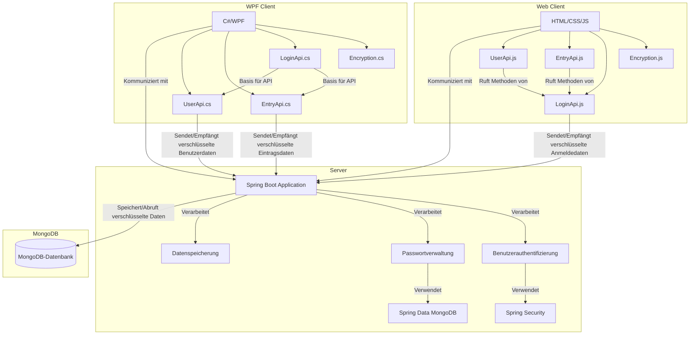


### Funktionalitäten des Passwortmanagers
Die Funktionalitäten des Passwortmanagers umfassen folgende Aspekte:


- **Passwortspeicherung und -verwaltung**: Der Passwortmanager ermöglicht es Benutzern, ihre Passwörter sicher zu speichern und zu organisieren.

- **Automatische Passwortgenerierung**: Der Passwortmanager hilft Benutzern starke Passwörter für ihre Konten zu generieren um die Sicherheit zu verbessern.

- **Verschlüsselung**: Die Daten werden im Passwortmanager verschlüsselt, um sie vor unbefugtem Zugriff zu schützen. Dies gewährleistet die Sicherheit der gespeicherten Passwörter.

- **Benutzerauthentifizierung**: Um auf die gespeicherten Passwörter zugreifen zu können, muss sich der Benutzer mit seinem Master-Passwort anmelden.

### Sicherheit und Verschlüsselung

Alle sensiblen Daten, einschließlich Passwörter und Zugangsdaten, werden mit dem Advanced Encryption Standard (AES) verschlüsselt. Diese Verschlüsselung erfolgt Ende-zu-Ende.

Zusätzlich zur AES-Verschlüsselung wird der Masterkey, der für den Zugriff der Einträge benötigt wird, ebenfalls gehasht, um die Sicherheit zu erhöhen.


### Technologien

#### Backend

- **Spring Framework**: Verwendet für die Erstellung des RESTful Web Services und die Implementierung der Backend-Logik.
- **Spring Boot**: Verwendet für die schnelle Entwicklung von Spring-Anwendungen und die Automatisierung des Konfigurationsprozesses.
- **Spring Data JPA**: Datenzugriffsschicht zur einfachen Integration von JPA (Java Persistence API).
- **Spring Security**: Sicherheitsschicht zur Authentifizierung und Autorisierung.
- **MongoDB**: Als NoSQL-Datenbank verwendet, um die Benutzer- und Eintragsdaten persistent zu speichern.

- **Java**: Verwendet als Programmiersprache für die Entwicklung der Serveranwendung.
- **Maven**: Build- und Abhängigkeitsmanagement-Tool.

#### Web Client

- **Node.js**: JavaScript-Laufzeitumgebung zur Ausführung von serverseitigem Code.
- **Express**: Webframework für Node.js, das zum Erstellen des RESTful API genutzt wird.
- **Axios**: HTTP-Client zum Senden von HTTP-Anfragen.
- **cors**: Middleware für Cross-Origin Resource Sharing, um die Kommunikation zwischen Frontend und Backend zu ermöglichen.
- **CryptoJS**: Bibliothek für Kryptographie, um Daten zu verschlüsseln und zu entschlüsseln.
- **express-session**: Sitzungsmanagement zur Verwaltung von Benutzersitzungen.
- **nodemon**: Werkzeug zur automatischen Neustart von Node.js-Anwendungen bei Dateiänderungen.

#### Desktop Client

- **WPF (Windows Presentation Foundation)**: Framework zur Erstellung von Desktop-Anwendungen für Windows.
- **C#**: Programmiersprache zur Entwicklung des Desktop-Clients.
- **Newtonsoft.Json**: JSON-Framework für .NET zur Serialisierung und Deserialisierung von JSON-Daten.
- **Microsoft.Extensions.Configuration**: Konfigurationsverwaltung für .NET-Anwendungen.
- **Microsoft.Extensions.DependencyInjection**: Abhängigkeitsinjektion für .NET-Anwendungen.
- **PasswordGenerator**: Bibliothek zur Erstellung von sicheren Passwörtern.
- **Credential Management**: Verwendet zur sicheren Verwaltung der AES-Keys. Diese Komponente speichert und verwaltet den AES-Keys eines Users unter seinem Username sicher und verschlüsselt.


#### Dokumentation

- **Markdown**: Zur Dokumentation und Formatierung der Projektdokumentation verwendet.
- **Mermaid**: Bibliothek zur Erstellung und Darstellung von Diagrammen und Grafiken innerhalb der Markdown-Dokumentation.


## <u>Installation</u>

Um den Passwortmanager zu installieren und nutzen zu können, müssen Sie die folgenden Schritte ausführen:

1. Das Projekt herunterladen und anschließend entzippen.
2. Öffnen Sie den Ordner 'Server' mit InteliJ oder einer IDE Ihrer Wahl und führen sie die Datei 'PasswortmanagerApplication.java' aus.
3. Nun wo der Server seinen Service bereit stellt, können Sie einen der beiden Clients starten und ebenfalls ausführen.
4. Haben Sie sich für den WPF-Client entscheiden, öffnen Sie die Datei mit dem Namen 'PasswortmanagerWPF.sln' und drücken Sie, nachdem sich das Projekt in VS geöffnet hat, ```F5``` um das Projekt auszuführen.
5. Um den Web-Client zu starten, öffnen sie den Ordner 'PasswortmanagerWeb' in VS Code und geben sie anschließend ```npm start``` im Terminal ein. Der Dienst sollte nun unter https://localhost:3001/login erreichbar sein.


## <u>Server</u>

### Spring-Boot
Die Spring-Boot-Anwendung bildet das Backend des Passwortmanagers. Sie verwendet das Spring-Framework für die Erstellung von RESTful Web Services. Die Hauptfunktionalitäten des Servers umfassen die Verarbeitung von Anfragen von Clients, die Authentifizierung und Autorisierung von Benutzern sowie die Interaktion mit der Datenbank zur Speicherung und Abruf von Benutzer- und Eintragsdaten.

### API
Die API des Servers definiert verschiedene Endpunkte, über die Clients mit der Anwendung interagieren können. Diese Endpunkte ermöglichen das Erstellen, Lesen, Aktualisieren und Löschen von Einträgen.

Der Server stellt zwei Controller bereit: 
* EntryController
* UserController

Die einzelnen Endpunkte der Controller sind erreichar unter
* /entries
* /users
 


#### Routen

##### **UserController** (`/users`):

##### Create
- `/create`: Ein POST-Endpunkt, der verwendet wird, um einen neuen Benutzer in der DB zu speichern. Der Client sendet Benutzerdaten an diesen Endpunkt, und der Server erstellt dann den entsprechenden Benutzer in der DB.
  

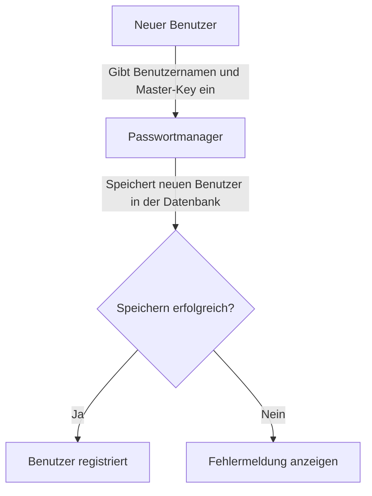


##### Authenticate
- `/authenticate`: Ein POST-Endpunkt, der für die Benutzeranmeldung verwendet wird. Der Client sendet Anmeldeinformationen an diesen Endpunkt, und der Server überprüft die Gültigkeit dieser Informationen. Wenn die Anmeldeinformationen korrekt sind und in der DB enthalten sind, wird der Benutzer angemeldet und erhält Zugriff auf die Daten.

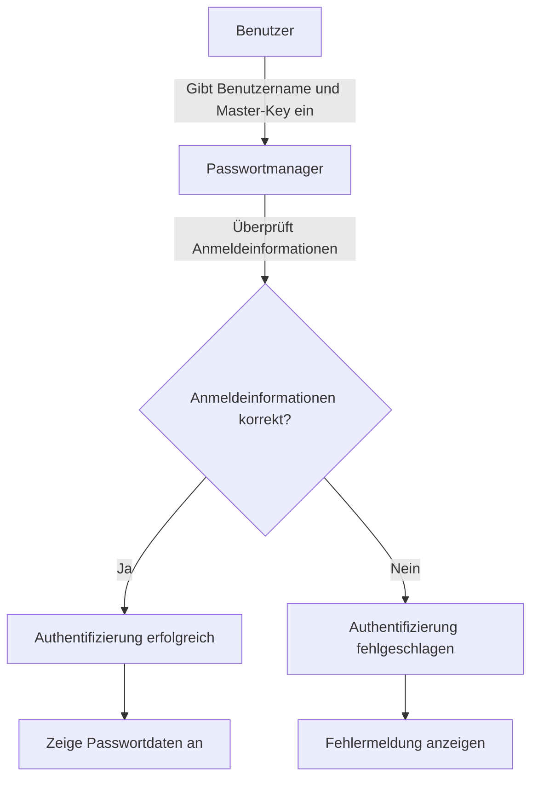

##### Id
- `/{id}`: Ein GET-Endpunkt, der verwendet wird, um Benutzerdetails anhand der Benutzer-ID abzurufen. Der Client kann die Benutzer-ID als Teil der URL bereitstellen, und der Server gibt dann die Details des entsprechenden Benutzers zurück.

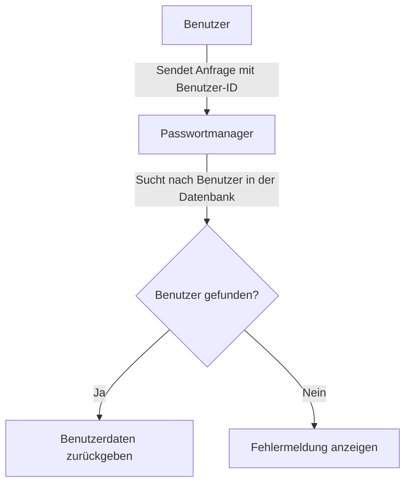

##### getUserByUsernameAndMasterKey
- `/getUserByUsernameAndMasterKey`: Ein POST-Endpunkt, der verwendet wird, um einen Benutzer anhand seines Benutzernamens und seines Master-Passworts abzurufen. Der Client sendet Benutzerdaten an diesen Endpunkt, und der Server gibt den entsprechenden Benutzer zurück, falls vorhanden.

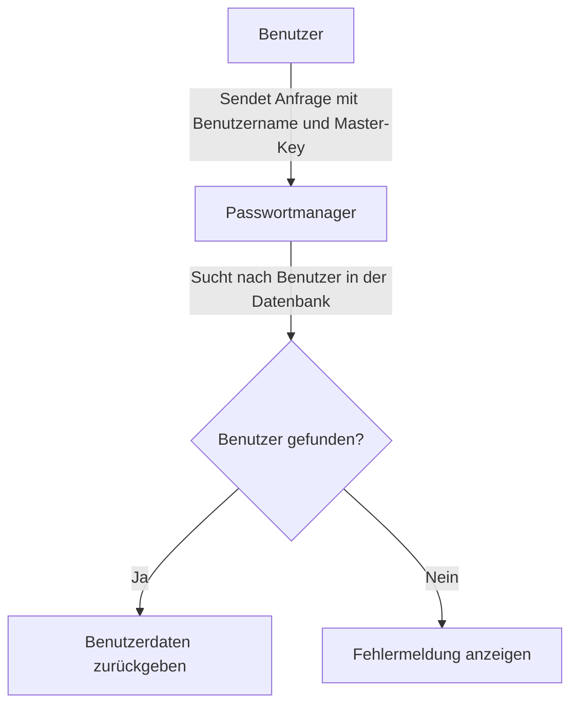

##### **EntryController** (`/entries`):

##### addEntry
- `/addEntry/{userId}`: Ein POST-Endpunkt, der verwendet wird, um einen neuen Eintrag für einen bestimmten Benutzer hinzuzufügen. Der Client sendet Eintragsdaten an diesen Endpunkt, und der Server fügt dann den Eintrag zur Liste der Einträge des Benutzers hinzu.
  
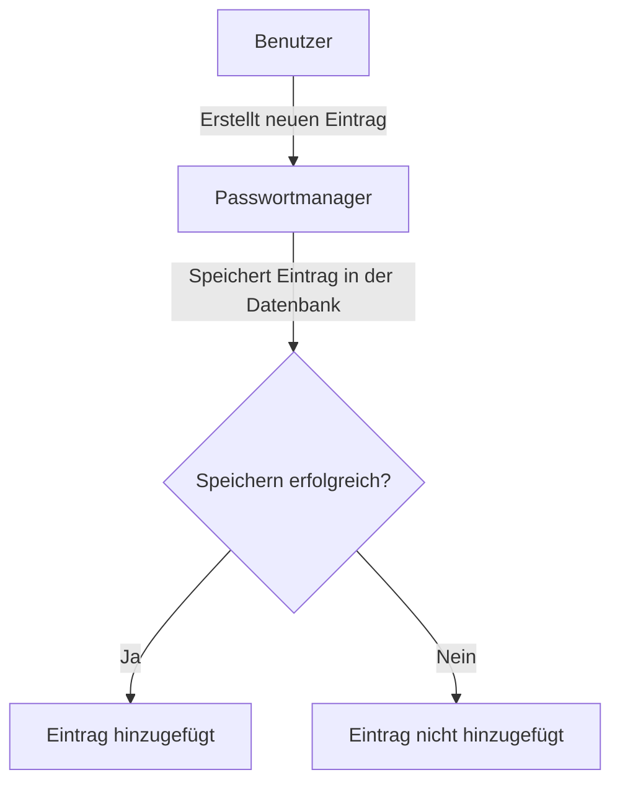

##### deleteEntry
- `/delete/{id}`: Ein POST-Endpunkt, der verwendet wird, um einen Eintrag anhand seiner ID zu löschen. Der Client sendet die ID des zu löschenden Eintrags an diesen Endpunkt, und der Server löscht dann den Eintrag aus der DB.

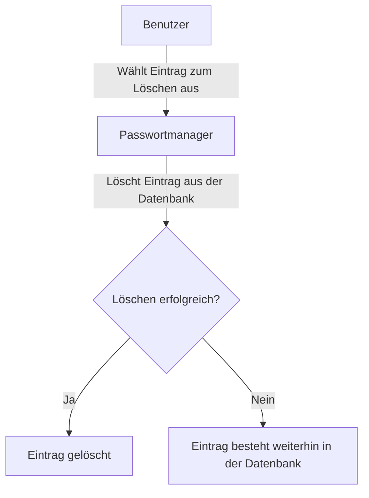

##### editEntry
- `/editEntry/{id}`: Ein POST-Endpunkt, der verwendet wird, um einen Eintrag anhand seiner ID zu bearbeiten. Der Client sendet aktualisierte Eintragsdaten an diesen Endpunkt, und der Server aktualisiert dann die entsprechenden Eintragsdetails in der DB.

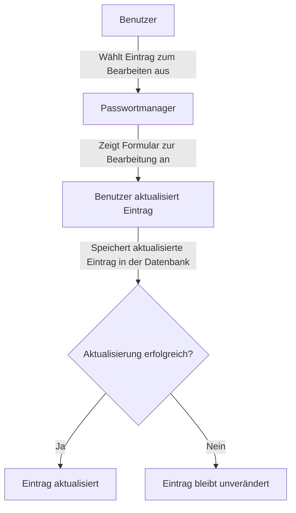

#### Actuator
- `/actuator/health`: Der Actuator bietet die Möglichkeit, den Zustand des Servers zu überwachen und abzurufen, indem der Status der einzelnen Module des Servers regelmäßig geprüft werden ([Heartbeat](https://docs.spring.io/spring-boot/docs/current/reference/html/actuator.html#actuator.endpoints.health)). 
Der Actuator kennt dabei folgende Zustände, die dann über die Route abrufbar sind:
  - `UP`
  - `DOWN`
  - `OUT_OF_SERVICE`
  - `UNKNOWN`
  
  
  
### Datenbank  
Die Anwendung verwendet MongoDB als Datenbank und speichert folgende Klassen:

#### Benutzer (UserModel)

- **id**: Die eindeutige Kennung des Benutzers.
- **username**: Der Benutzername des Benutzers.
- **entries**: Eine Liste von Einträgen, die diesem Benutzer zugeordnet sind.
- **masterKey**: Der Master-Key des Benutzers, der für die Authentifizierung verwendet wird.
  
#### Eintrag (EntryModel)

- **id**: Die eindeutige Kennung des Eintrags.
- **title**: Der Titel des Eintrags.
- **username**: Der Benutzername für den Eintrag.
- **password**: Das Passwort für den Eintrag.
- **url**: Die URL, die mit diesem Eintrag verknüpft ist.
- **notes**: Zusätzliche Notizen oder Informationen zu diesem Eintrag.

#### ER-Diagramm

Dieses ER-Diagramm zeigt die Datenbankstruktur des Passwortmanagers. Es gibt zwei Entitäten: Benutzer (USER) und Eintrag (ENTRY). Jeder Benutzer kann mehrere Einträge haben, aber jeder Eintrag gehört nur zu einem Benutzer.

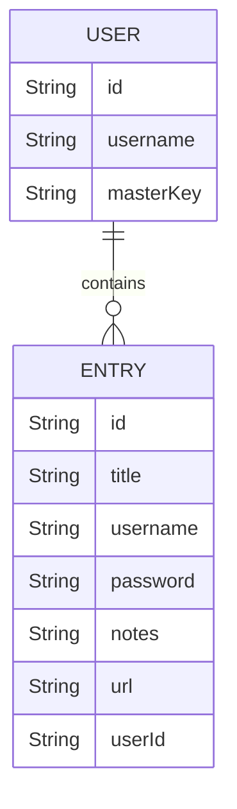


# Clients

## Wichtige Klassen

### API
Diese Klassen enthalten alle Methoden, die mit dem Spring Boot Server kommunizieren. Die Beziehungen zwischen diesen Klassen ist im Diagramm dargestellt.


```
- LoginApi.js
- EntryApi.js
- UserApi.js
```

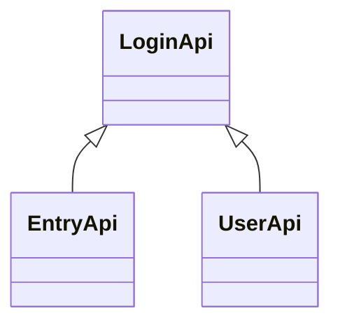

### Models & DTOs
Diese Klassen definieren die Struktur der Benutzerdaten. Die Models dienen der internen Verarbeitung, während die DTOs verwendet werden, um Daten mit dem Server auszutauschen.

```
- UserModel.js / UserDTO.js
- EntryModel.js / EntryDTO.js
```

### Encryption
Diese abstrakte Klasse enthält statische Methoden deren einzige Aufgabe darin besteht, sensible Daten mittels AES zu verschlüsseln und entschlüsseln.

```
- Encryption.js
```


## <u>WPF-Application</u>

### Klassendiagram
In diesem Abschnitt ist das Klassendiagramm für die WPF-Anwendung des Passwortmanagers zu sehen. Das Diagramm visualisiert die Struktur der Anwendung, sowie deren Beziehungen untereinander.
Die Anwendung ist in fünf Hauptkategorien unterteilt: Model, DTO, API, Window und Encryption.


```mermaid

classDiagram

    %% Category: Models
    class UserModel {
        +string id
        +string username
        +List~EntryModel~ entries
        +string masterKey
    }
    UserModel --> ModelCategory

    class EntryDTO {
        +string id
        +string title
        +string username
        +string password
        +string url
        +string notes
    }
    EntryDTO --> DTOCategory

    class EntryModel {
        +string id
        +string title
        +string username
        +string password
        +string url
        +string notes
        +string ToString()
    }
    EntryModel --> ModelCategory

    class UserDTO {
        +string id
        +string username
        +List~EntryModel~ entries
        +string masterKey
    }
    UserDTO --> DTOCategory

    %% Category: API
    class UserApi {
        +Task~UserModel~ CreateUserAsync(UserDTO userDto)
        +string EncodeMasterKey(string secret)
        +Task~UserModel~ AuthenticateUserAsync(UserDTO userDto)
        +Task~UserModel~ GetUserById(string id)
    }
    UserApi --> LoginApi
    UserApi --> UserModel
    UserApi --> UserDTO
    UserApi --> APICategory

    class EntryApi {
        +void DeleteEntry(EntryModel selectedEntry)
        +void EditEntry(EntryDTO entryDto)
        +void CreateEntry(EntryDTO entryDto)
    }
    EntryApi --> LoginApi
    EntryApi --> EntryModel
    EntryApi --> EntryDTO
    EntryApi --> APICategory



    class LoginApi {
        -HttpClient _httpClient
        -string _connectionString
        +HttpClient GetHttpClient()
        +string GetConnectionString()
    }
    LoginApi <|-- UserApi
    LoginApi <|-- EntryApi
    LoginApi --> APICategory
    
    %% Category: Encryption
    class Encryption {
        +static EntryDTO EncryptEntry(EntryDTO entry)
        +static EntryDTO DecryptEntry(EntryDTO entry)
        +static List~EntryModel~ EncryptEntries(List~EntryModel~ entries)
        +static List~EntryModel~ DecryptEntries(List~EntryModel~ entries)
        +static string EncryptMessage(string message, byte[] fileKey=null)
        +static string DecryptMessage(string encryptedMessage, byte[] fileKey=null)
        +static object EncryptUser(object user)
        +static object DecryptUser(object user)
    }
    
    Encryption --> EncryptionCategory

    %% Category: Windows
    class PasswordInputWindow {
        +event EventHandler~Tuple~string, string~~ FileInput
        -string jsonString
        +PasswordInputWindow(string jsonString="")
        +void ConfirmButton_Click(object sender, RoutedEventArgs e)
    }
    PasswordInputWindow --> WindowCategory

    class PasswordGeneratorWindow {
        +event EventHandler~string~ PasswordGenerated
        +PasswordGeneratorWindow()
        +string GeneratePassword()
        +void ConfirmButton_Click(object sender, RoutedEventArgs e)
    }
    PasswordGeneratorWindow --> WindowCategory

    class MainWindow {
        +ObservableCollection~EntryModel~ entries
        +EntryModel selectedEntry
        +MainWindow(UserModel user)
        +void MainWindow_Loaded(object sender, RoutedEventArgs e)
        +void ExportEntries_Click(object sender, EventArgs e)
        +void PasswordInputWindow_FileInput(object sender, Tuple~string, string~ data)
        +void ImportEntries_Click(object sender, EventArgs e)
        +void DeleteEntry_Click(object sender, EventArgs e)
        +void LockManager_Click(object sender, EventArgs e)
        +void EntryWindow_EntryCreated(object sender, UserModel userModel)
        +void AddEntry_Click(object sender, EventArgs e)
        +void EditEntry_Click(object sender, EventArgs e)
        +void dataGrid_SelectionChanged(object sender, SelectionChangedEventArgs e)
        +void dataGrid_MouseDoubleClick(object sender, MouseButtonEventArgs e)
        +DataGridCell GetCell(object sender, MouseButtonEventArgs e)
    }
    MainWindow --> WindowCategory

    class EntryWindow {
        -bool edit
        +EntryWindow()
        +EntryWindow(EntryModel entry)
        +void EntryWindow_Loaded(object sender, RoutedEventArgs e)
        +void ConfirmButton_Click(object sender, RoutedEventArgs e)
        +void GeneratePassword_Click(object sender, RoutedEventArgs e)
        +void PasswordGeneratorWindow_PasswordGenerated(object sender, string password)
        +void TogglePasswordVisibility_Click(object sender, RoutedEventArgs e)
    }
    EntryWindow --> WindowCategory
    EntryWindow --> EntryModel
    EntryWindow --> EntryDTO

    class LoginWindow {
        +LoginWindow()
        +void SignUpButton_Click(object sender, RoutedEventArgs e)
        +void SetAesKeyForUser(string username)
        +byte[] GetAesKeyForUser(string username)
        +bool AesKeyExistsForUser(string username)
        +void SignInButton_Click(object sender, RoutedEventArgs e)
        +string IsValidPassword(string masterkey)
        +void TextBox_GotFocus(object sender, RoutedEventArgs e)
        +void TextBox_LostFocus(object sender, RoutedEventArgs e)
    }
    LoginWindow --> WindowCategory
    LoginWindow --> UserDTO
    LoginWindow --> UserApi


```

#### weitere Kategorien

**Windows**: Diese Kategorie umfasst die Fensterklassen, die die Benutzeroberfläche der Anwendung darstellen und Benutzerinteraktionen verwalten.
- `MainWindow` ist das Hauptfenster der Anwendung und verwaltet Benutzerinteraktionen und Anwendungslogik, wie z.B. das Laden von Benutzerdaten, Exportieren und Importieren von Einträgen, sowie die Handhabung von Benutzerinteraktionen.
- `EntryWindow` ermöglicht die Erstellung und Bearbeitung von Einträgen.
- `LoginWindow` verwaltet die Benutzeranmeldung und -registrierung und bietet Methoden zur Verwaltung von AES-Schlüsseln und Passwortvalidierung.
- `PasswordInputWindow` und `PasswordGeneratorWindow` bieten spezifische Funktionalitäten zur Passwortverwaltung, einschließlich der Eingabe und Generierung von Passwörtern.


#### Aktivitätsdiagramm

Dieses Aktivitätsdiagramm beschreibt den Ablauf des Passwortmanagers. Ein Benutzer öffnet die Anwendung und kann sich entweder registrieren oder anmelden. Bei der Registrierung werden Benutzerdaten verschlüsselt an den Server gesendet, validiert und in der Datenbank gespeichert. Nach erfolgreicher Registrierung erfolgt die Anmeldung durch Übermittlung und Validierung der Anmeldedaten. Nach der Anmeldung kann der Benutzer Passwörter verwalten, indem er Einträge erstellt, bearbeitet oder löscht. Die Daten werden verschlüsselt an den Server gesendet, validiert und in der Datenbank gespeichert. Die Aktivität endet mit dem Schließen der Anwendung oder dem Ausloggen.


``` mermaid
graph TD;
    Start -->|Benutzer öffnet Anwendung| Open[Anwendung geöffnet]

    subgraph Registrierung
        Open -->|Benutzer navigiert zur Registrierungsseite| RegNavigate[Registrierungsseite geöffnet]
        RegNavigate -->|Benutzer gibt Registrierungsdaten ein| RegInput[Registrierungsdaten eingegeben]
        RegInput -->|Daten werden verschlüsselt| RegEncrypt[Daten verschlüsselt]
        RegEncrypt -->|Verschlüsselte Daten werden an Server gesendet| RegSend[Gesendete Daten]
        RegSend -->|Server validiert Registrierungsdaten| RegValidate[Server validiert Daten]
        RegValidate -->|Benutzerdaten werden in der Datenbank gespeichert| RegStore[Benutzerdaten gespeichert]
        RegStore -->|Erfolgsmeldung an Benutzer| RegSuccess[Registrierung erfolgreich]
    end

    subgraph Anmeldung
        Open -->|Benutzer navigiert zur Anmeldeseite| LoginNavigate[Anmeldeseite geöffnet]
        LoginNavigate -->|Benutzer gibt Anmeldedaten ein| LoginInput[Anmeldedaten eingegeben]
        LoginInput -->|Daten werden verschlüsselt| LoginEncrypt[Daten verschlüsselt]
        LoginEncrypt -->|Verschlüsselte Daten werden an Server gesendet| LoginSend[Gesendete Daten]
        LoginSend -->|Server validiert Anmeldedaten| LoginValidate[Server validiert Daten]
        LoginValidate -->| Erfolgreiche Anmeldung| LoginSuccess[Anmeldung erfolgreich]
    end

    subgraph Passwortverwaltung
        LoginSuccess -->|Benutzer navigiert zur Eintragsseite| EntryNavigate[Eintragsseite geöffnet]
        EntryNavigate -->|Benutzer erstellt neuen Eintrag| CreateEntry[Neuer Eintrag]
        CreateEntry -->|Benutzer gibt Eintragsdaten ein| EntryInput[Eintragsdaten eingegeben]
        EntryInput -->|Daten werden verschlüsselt| EntryEncrypt[Daten verschlüsselt]
        EntryEncrypt -->|Verschlüsselte Daten werden an Server gesendet| EntrySend[Gesendete Daten]
        EntrySend -->|Server validiert Eintragsdaten| EntryValidate[Server validiert Daten]
        EntryValidate -->|Eintrag wird in der Datenbank gespeichert| EntryStore[Eintrag gespeichert]
        EntryStore -->| Eintrag erfolgreich erstellt | EntrySuccess[Eintrag erfolgreich erstellt]

        EntrySuccess -->|Benutzer lädt Einträge| LoadEntries[Einträge laden]
        LoadEntries -->|Server lädt Einträge aus der Datenbank| LoadFromDB[Einträge aus DB laden]
        LoadFromDB -->|Verschlüsselte Einträge werden an Client gesendet| SendToClient[Gesendete Einträge]
        SendToClient -->|Client entschlüsselt Einträge| DecryptEntries[Einträge entschlüsseln]
        DecryptEntries -->|Einträge werden dem Benutzer angezeigt| DisplayEntries[Einträge anzeigen]

        DisplayEntries -->|Benutzer bearbeitet Eintrag| EditEntry[Eintrag bearbeiten]
        EditEntry -->|Benutzer gibt neue Eintragsdaten ein| EditInput[Neue Eintragsdaten]
        EditInput -->|Daten werden verschlüsselt| EditEncrypt[Daten verschlüsselt]
        EditEncrypt -->|Verschlüsselte Daten werden an Server gesendet| EditSend[Gesendete Daten]
        EditSend -->|Server validiert Änderungen| EditValidate[Server validiert Änderungen]
        EditValidate -->|Änderungen werden in der Datenbank gespeichert| EditStore[Änderungen gespeichert]
        EditStore -->|erfolgreich bearbeitet| EditSuccess[Eintrag erfolgreich bearbeitet]

        DisplayEntries -->|Benutzer löscht Eintrag| DeleteEntry[Eintrag löschen]
        DeleteEntry -->|Löschanfrage wird an Server gesendet| DeleteSend[Gesendete Löschanfrage]
        DeleteSend -->|Server validiert Löschanfrage| DeleteValidate[Server validiert Löschanfrage]
        DeleteValidate -->|Eintrag wird aus der Datenbank gelöscht| DeleteStore[Eintrag gelöscht]
        DeleteStore -->| erfolgreich gelöscht| DeleteSuccess[Eintrag erfolgreich gelöscht]
    end

    RegSuccess -->|Benutzer navigiert zur Anmeldeseite| LoginNavigate
    LoginSuccess --> EntryNavigate
    EntrySuccess --> LoadEntries
    EditSuccess --> LoadEntries
    DeleteSuccess --> LoadEntries
    End[Ende]

``` 


### Wichtige Methoden

#### UserApi

##### CreateUserAsync:
Diese Methode dient dazu, einen neuen Benutzer in einem System zu erstellen. Sie nimmt als Parameter ein Datenübertragungsobjekt (userDto) entgegen, das die Benutzerdaten enthält. Zunächst wird der Master-Key des Benutzers verschlüsselt, bevor die Benutzerdaten mittels einer Post-Request an den Server gesendet werden.
Wenn der Server einen Erfolgstatus zurückgibt, wird der User über die erfolgreiche Erstellung informiert, ansonsten wird im mittgeteilt, dass der Benutzername bereits vergeben ist. 

``` csharp
        public async Task<UserModel> CreateUserAsync(UserDTO userDto)
        {
            userDto.masterKey = EncodeMasterKey(userDto.masterKey);

            HttpResponseMessage response = null;

            try
            {
                response = await GetHttpClient().PostAsJsonAsync(GetConnectionString() + "/users/create", userDto);
                response.EnsureSuccessStatusCode();
                

                MessageBox.Show("Benutzer erfolgreich erstellt! " + Char.ConvertFromUtf32(0x1F480));
            }
            catch (Exception ex)
            {
                MessageBox.Show("Username ist bereits vergeben!");

            }


            return null;
        }
```

##### AuthenticateUserAsync
Der User wird beim einloggen authentifiziert, indem er die Benutzerdaten an den Server sendet und die Antwort des Servers überprüft. Zuerst wird der Master-Key des Benutzers verschlüsselt. Dann wird eine HTTP POST-Anfrage an den Server gesendet, die die Benutzerdaten enthält.

Nachdem die Antwort des Servers empfangen wurde und ein erfolgreicher Statuscode zurückgegeben wurde, wird die Antwort des Servers gelesen und in ein UserModel-Objekt deserialisiert. Dieses UserModel-Objekt enthält die authentifizierten Benutzerdaten, die dann zurückgegeben werden. 


```csharp
        public async Task<UserModel> AuthenticateUserAsync(UserDTO userDto)
        {

            userDto.masterKey = EncodeMasterKey(userDto.masterKey);

            var response = await GetHttpClient().PostAsJsonAsync(GetConnectionString() + "/users/authenticate", userDto);
            response.EnsureSuccessStatusCode();

            return JsonConvert.DeserializeObject<UserModel>(await response.Content.ReadAsStringAsync());
        }
```

##### GetUserById

Diese Methode ruft einen Benutzer anhand seiner ID vom Server ab. Dazu wird eine HTTP GET-Anfrage an den Server gesendet, wobei die Benutzer-ID als Teil der URL mitgeliefert wird. Als Antwort erhält der Client den gespeicherten User mit der selben ID wie in der Datenbank.

```csharp
        public async Task<UserModel> GetUserById(string id)
        {

            var response = await GetHttpClient().GetAsync(GetConnectionString() + ("/users/" + id));
            response.EnsureSuccessStatusCode();


            return await response.Content.ReadAsAsync<UserModel>();
        }
```


#### EntryApi

##### CreateEntry
Die Methode CreateEntry dient dazu, einen neuen Eintrag für einen Benutzer zu erstellen. Sie verschlüsselt die Eintragsdaten und sendet sie an den Server, um sie in der Datenbank zu speichern. Wenn die Erstellung nicht erfolgreich war, wird dies dem User mitgeteilt.

```csharp
        public async void CreateEntry(EntryDTO entryDto)
        {
            try
            {
                UserModel user = UserApi.user;
                UserDTO userDTO = new UserDTO();

                userDTO.username = user.username;
                userDTO.id = user.id;
                userDTO.masterKey = user.masterKey;

                userDTO.entries = user.entries;


                entryDto = Encryption.EncryptEntry(entryDto);

                UserApi userApi = UserApi.GetInstance();

                var response = await GetHttpClient().PostAsJsonAsync(GetConnectionString() + "/entries/addEntry/" + user.id, entryDto);
                response.EnsureSuccessStatusCode();


                UserApi.user = await UserApi.GetInstance().GetUserById(UserApi.user.id);

                EntryCreated?.Invoke(this, user);
            }
            catch (Exception ex)
            {
                MessageBox.Show("Creating/Editing Entry failed!");
            }
        }
```

##### EditEntry
Diese Methode folgt der seblen funktionsweise wie die Funktion CreateEntry. Der Hauptunterschied liegt darin, dass der Server mit den entgegengenommenen Daten keinen neuen Entry erstellt, sondern nach dem Entry mit jener ID sucht, und diesen aktualisiert.

```csharp
        public async void EditEntry(EntryDTO entryDto)
        {

            try
            {
                UserModel user = UserApi.user;
                UserDTO userDTO = new UserDTO();
                userDTO.id = user.id;

                entryDto = Encryption.EncryptEntry(entryDto);

                var response = await GetHttpClient().PostAsJsonAsync(GetConnectionString() + "/entries/editEntry/" + userDTO.id, entryDto);
                response.EnsureSuccessStatusCode();


                UserApi.user = await UserApi.GetInstance().GetUserById(UserApi.user.id);

                EntryCreated?.Invoke(this, user);
            }
            catch (Exception ex)
            {
                MessageBox.Show("Creating/Editing Entry failed!");
            }

        }
```

##### DeleteEntry

Die Methode DeleteEntry dient dazu, einen ausgewählten Eintrag eines Benutzers zu löschen. Sie sendet die Anfrage an den Server und entfernt anschließend den entsprechenden Eintrag aus der Liste.


```csharp
        public async void DeleteEntry(EntryModel selectedEntry)
        {
            try
            {
                UserModel user = UserApi.user;
                UserDTO userDTO = new UserDTO();

                userDTO.username = user.username;
                userDTO.id = user.id;
                userDTO.masterKey = user.masterKey;
                userDTO.entries = user.entries;


                var response = await GetHttpClient().PostAsJsonAsync(GetConnectionString() + "/entries/delete/" + selectedEntry.id, userDTO);
                response.EnsureSuccessStatusCode();

                int entryCount = user.entries.Count;

                for (int i = 0; entryCount == user.entries.Count; i++)
                {
                    if (user.entries[i].id == selectedEntry.id)
                    {
                        user.entries.RemoveAt(i);
                    }
                }

                UserApi.user = user;

                EntryCreated?.Invoke(this, user);
            }
            catch (Exception ex)
            {
                MessageBox.Show("Deleting Entry failed!");
            }
        }
```

## <u>Web-Application</u>

### Einführung
Die Web-Anwendung des Passwortmanagers bietet Benutzern die Möglichkeit, von verschiedenen Plattformen aus auf ihre gespeicherten Passwörter zuzugreifen und sie zu verwalten.

### Technologien
Die Web-Anwendung wird mithilfe von `Node.js` entwickelt, was die  die Ausführung von JavaScript-Code auf dem Server ermöglicht und eine Vielzahl von Modulen und Tools anbietet, um die Entwicklung zu erleichtern. 


### Probleme
Die CORS-Einschränkung des Browsers kann dazu führen, dass Anfragen zwischen verschiedenen Ursprüngen blockiert werden. Ohne eine entsprechende Konfiguration funktioniert die Kommunikation zwischen dem Web-Client und dem Server nicht ordnungsgemäß.


### NodeJS Config

Um CORS-Probleme zu lösen, wird eine Middleware in der Node.js-Anwendung verwendet. Diese Middleware fügt den HTTP-Antworten die erforderlichen CORS-Header hinzu, um Anfragen von einem bestimmten Ursprung zu akzeptieren. In der Konfiguration wird festgelegt, von welchem Ursprung Anfragen akzeptiert werden sollen, welche Methoden erlaubt sind und welche Header verwendet werden dürfen.

```javascript
app.use((req, res, next) => {
    res.setHeader('Access-Control-Allow-Origin', 'http://localhost:3000'); 
    res.setHeader('Access-Control-Allow-Methods', 'GET, POST, OPTIONS, PUT');
    res.setHeader('Access-Control-Allow-Headers', 'Content-Type');
    next();
});
```

### SpringBoot Config
Auf der Serverseite wird ebenefalls eine CORS-Konfiguration vorgenommen. 

``` java
@Configuration
public class CorsConfiguration implements WebMvcConfigurer {


    @Override
    public void addCorsMappings(CorsRegistry registry) {
        registry.addMapping("/**")
                .allowedOrigins("http://localhost:3001")
                .allowedMethods("GET", "POST", "PUT", "DELETE", "OPTIONS")
                .allowedHeaders("*")
                .allowCredentials(true)
                .maxAge(3600);
    }
}
```

Zudem muss folgende Annotation für die Controller verwendet werden, um die Konfiguration der Klasse `CorsConfiguration`  anzuwenden.

``` java
@CrossOrigin(origins="http://localhost:3001")
```


## Diskussion der Ergebnisse

### Zusammenfassung
Der Passwortmanager ist eine plattformübergreifende Anwendung, die es Benutzern ermöglicht, ihre Zugangsdaten verschlüsselt zu speichern und zu verwalten. Die Anwendung besteht aus einem Server, der mit Spring Boot implementiert ist, sowie aus zwei Clients: einem WPF-Client und einem Web-Client. Der Server verwendet MongoDB als Datenbank und bietet RESTful Web Services für die Kommunikation mit den Clients. 

### Ausblick
#### Sicherheit und Verschlüsselung
Mögliche sinnvolle Ergänzungen um die Sicherheit der Nutzer zu gewährleisten wäre die Verschlüsselung auszubauen. Zum jetzigen Zeitpunkt erfolgt die Verschlüsselung ohne Initialisierungsvektor (IV), was dafür sorgt, dass der gleiche Input mit dem gleichen AES-Key der Encryption-Methode den selben Output produziert. Der IV würde dazu beitragen die Identifizierung von Mustern in den verschlüsselten Dateien zu erschweren.

Eine weitere Sicherheitsmaßnahme könnte darin bestehen, alle Zugriffe auf die API zu protokollieren und im Falle von Sicherheitsvorfällen zu durchforsten, bzw bereits frühzeitig zu erkennen. 

Ebenso auch die Implementierung der Zwei-Faktor-Authentifizierung um selbst im Falle einer Kompression des Masterkeys sicherzustellen, dass sich nur der autorisierte Nutzer anmelden kann, und Zugriff auf die sensiblen Daten erhält.

#### Passwortrichtlinien
Eine weitere Möglichkeit zur Stärkung der Sicherheit des Passwortmanagers besteht in der Implementierung einer automatischen Überprüfung der Passwortstärke. Durch die Festlegung von Richtlinien für die Erstellung von Passwörtern können Benutzer dazu motiviert werden, starke und einzigartige Passwörter zu wählen, die schwer zu erraten oder zu knacken sind. 

#### Autofill
Eine nützliche Erweiterung wäre die Implementierung einer Autofill-Funktion, die es ermöglicht, gespeicherte Zugangsdaten automatisch in Anmeldeformulare einzutragen. 

