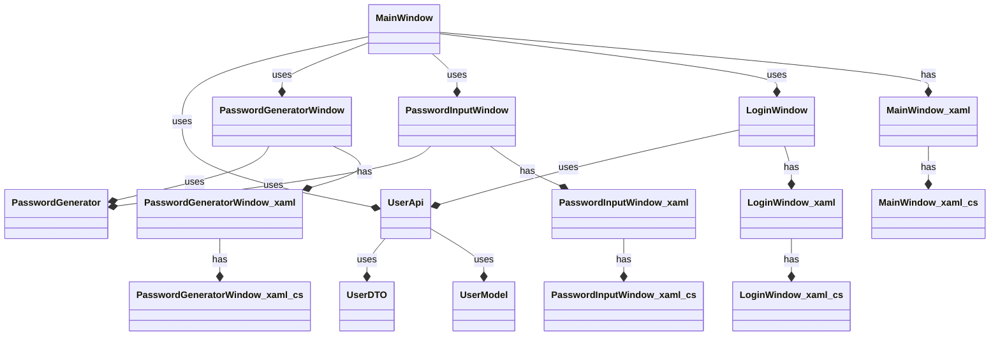

# Passwortmanager

## Inhaltsverzeichnis
- [Passwortmanager](#passwortmanager)
  - [Inhaltsverzeichnis](#inhaltsverzeichnis)
  - [Einführung](#einführung)
    - [Zweck des Passwortmanagers](#zweck-des-passwortmanagers)
    - [Bestandteile](#bestandteile)
  - [Softwarestruktur](#softwarestruktur)
    - [Funktionalitäten des Passwortmanagers](#funktionalitäten-des-passwortmanagers)
    - [Sicherheit und Verschlüsselung](#sicherheit-und-verschlüsselung)
    - [Technologien](#technologien)
  - [Installation](#installation)
  - [Server](#server)
    - [Spring-Boot](#spring-boot)
    - [API](#api)
      - [Routen](#routen)
        - [**UserController** (`/users`):](#usercontroller-users)
        - [Create](#create)
        - [Authenticate](#authenticate)
        - [id](#id)
        - [getUserByUsernameAndMasterKey](#getuserbyusernameandmasterkey)
        - [**EntryController** (`/entries`):](#entrycontroller-entries)
        - [addEntry](#addentry)
        - [deleteEntry](#deleteentry)
        - [editEntry](#editentry)
    - [Datenbank](#datenbank)
      - [Benutzer (UserModel)](#benutzer-usermodel)
      - [Eintrag (EntryModel)](#eintrag-entrymodel)
- [Clients](#clients)
  - [Wichtige Klassen](#wichtige-klassen)
    - [API](#api-1)
    - [Models \& DTOs](#models--dtos)
    - [Encryption](#encryption)
- [Diagramm](#diagramm)
  - [WPF-Application](#wpf-application)
    - [Wichtige Methoden](#wichtige-methoden)
      - [CreateUserAsync](#createuserasync)
  - [Web-Application](#web-application)
  - [Diskussion der Ergebnisse](#diskussion-der-ergebnisse)
    - [Sicherheit und Verschlüsselung](#sicherheit-und-verschlüsselung-1)
    - [](#)


## <u>Einführung</u>
### Zweck des Passwortmanagers

Der Zweck des Passwortmanagers besteht darin, sensible Zugangsdaten wie Benutzernamen, Passwörter und andere vertrauliche Informationen sicher zu speichern und zu verwalten. Dies ermöglicht es Benutzern, sichere Passwörter zu generieren, ohne sich die Kennwörter merken zu müssen.

### Bestandteile

Das Projekt besteht aus folgenden Hauptkomponenten:

- **Server**: Die Backend-Komponente, die mithilfe von Spring Boot implementiert ist. Der Server ist verantwortlich für die Verarbeitung von Anfragen der Clients, die Datenbankinteraktion und die Bereitstellung von RESTful Web Services (CRUD).

- **WPF-Client**: Ein Desktop-Client, der in C# implementiert ist. Dieser Client bietet eine grafische Benutzeroberfläche für die Benutzer des Passwortmanagers. Mit dem WPF-Client können Benutzer ihre Passwortdaten verwalten und verschiedene Funktionen des Passwortmanagers nutzen.


- **Web-Client**: Ein webbasierte Client-Anwendung, die mithilfe von HTML, Java und CSS entwickelt ist. Der Web-Client bietet eine plattformübergreifende Benutzeroberfläche für den Zugriff auf den Passwortmanager über einen Webbrowser. Benutzer können sich über den Web-Client anmelden, ihre Passwortdaten anzeigen und verwalten sowie verschiedene Funktionen des Passwortmanagers nutzen.
  


## Softwarestruktur


### Funktionalitäten des Passwortmanagers
Die Funktionalitäten des Passwortmanagers umfassen folgende Aspekte:


- **Passwortspeicherung und -verwaltung**: Der Passwortmanager ermöglicht es Benutzern, ihre Passwörter sicher zu speichern und zu organisieren.

- **Automatische Passwortgenerierung**: Der Passwortmanager hilft Benutzern starke Passwörter für ihre Konten zu generieren um die Sicherheit zu verbessern.

- **Verschlüsselung**: Die Daten werden im Passwortmanager verschlüsselt, um sie vor unbefugtem Zugriff zu schützen. Dies gewährleistet die Sicherheit der gespeicherten Passwörter.

- **Benutzerauthentifizierung**: Um auf die gespeicherten Passwörter zugreifen zu können, muss sich der Benutzer mit seinem Master-Passwort anmelden.

### Sicherheit und Verschlüsselung

Alle sensiblen Daten, einschließlich Passwörter und Zugangsdaten, werden mit dem Advanced Encryption Standard (AES) verschlüsselt. Diese Verschlüsselung erfolgt Ende-zu-Ende.

Zusätzlich zur AES-Verschlüsselung wird der Masterkey, der für den Zugriff der Einträge benötigt wird, ebenfalls gehasht, um die Sicherheit zu erhöhen.


### Technologien

- **Spring Framework**: Verwendet für die Erstellung des RESTful Web Services und die Implementierung der Backend-Logik.
- **Spring Boot**: Verwendet für die schnelle Entwicklung von Spring-Anwendungen und die Automatisierung des Konfigurationsprozesses.
- **MongoDB**: Als NoSQL-Datenbank verwendet, um die Benutzer- und Eintragsdaten persistent zu speichern.
- **Java**: Verwendet als Programmiersprache für die Entwicklung der Serveranwendung.
- **Markdown**: Zur Dokumentation und Formatierung der Projektdokumentation verwendet.


## <u>Installation</u>

Um den Passwortmanager zu installieren und nutzen zu können, müssen Sie die folgenden Schritte ausführen:

1. Das Projekt herunterladen und anschließend entzippen.
2. Öffnen Sie den Ordner 'Server' mit InteliJ oder einer IDE Ihrer Wahl und führen sie die Datei 'PasswortmanagerApplication.java' aus.
3. Nun wo der Server seinen Service bereit stellt, können Sie einen der beiden Clients starten und ebenfalls ausführen.
4. Haben Sie sich für den WPF-Client entscheiden, öffnen Sie die Datei mit dem Namen 'PasswortmanagerWPF.sln' und drücken Sie, nachdem sich das Projekt in VS geöffnet hat, ```F5``` um das Projekt auszuführen.
5. Um den Web-Client zu starten, öffnen sie den Ordner 'PasswortmanagerWeb' in VS Code und geben sie anschließend ```npm start``` im Terminal ein. Der Dienst sollte nun unter https://localhost:3001/login erreichbar sein.


## <u>Server</u>

### Spring-Boot
Die Spring-Boot-Anwendung bildet das Backend des Passwortmanagers. Sie verwendet das Spring-Framework für die Erstellung von RESTful Web Services. Die Hauptfunktionalitäten des Servers umfassen die Verarbeitung von Anfragen von Clients, die Authentifizierung und Autorisierung von Benutzern sowie die Interaktion mit der Datenbank zur Speicherung und Abruf von Benutzer- und Eintragsdaten.

### API
Die API des Servers definiert verschiedene Endpunkte, über die Clients mit der Anwendung interagieren können. Diese Endpunkte ermöglichen das Erstellen, Lesen, Aktualisieren und Löschen von Einträgen.

Der Server stellt zwei Controller bereit: 
* EntryController
* UserController

Die einzelnen Endpunkte der Controller sind erreichar unter
* /entries
* /users
 


#### Routen

##### **UserController** (`/users`):

##### Create
- `/create`: Ein POST-Endpunkt, der verwendet wird, um einen neuen Benutzer in der DB zu speichern. Der Client sendet Benutzerdaten an diesen Endpunkt, und der Server erstellt dann den entsprechenden Benutzer in der DB.
  


##### Authenticate
- `/authenticate`: Ein POST-Endpunkt, der für die Benutzeranmeldung verwendet wird. Der Client sendet Anmeldeinformationen an diesen Endpunkt, und der Server überprüft die Gültigkeit dieser Informationen. Wenn die Anmeldeinformationen korrekt sind und in der DB enthalten sind, wird der Benutzer angemeldet und erhält Zugriff auf die Daten.


##### id
- `/{id}`: Ein GET-Endpunkt, der verwendet wird, um Benutzerdetails anhand der Benutzer-ID abzurufen. Der Client kann die Benutzer-ID als Teil der URL bereitstellen, und der Server gibt dann die Details des entsprechenden Benutzers zurück.


##### getUserByUsernameAndMasterKey
- `/getUserByUsernameAndMasterKey`: Ein POST-Endpunkt, der verwendet wird, um einen Benutzer anhand seines Benutzernamens und seines Master-Passworts abzurufen. Der Client sendet Benutzerdaten an diesen Endpunkt, und der Server gibt den entsprechenden Benutzer zurück, falls vorhanden.


##### **EntryController** (`/entries`):

##### addEntry
- `/addEntry/{userId}`: Ein POST-Endpunkt, der verwendet wird, um einen neuen Eintrag für einen bestimmten Benutzer hinzuzufügen. Der Client sendet Eintragsdaten an diesen Endpunkt, und der Server fügt dann den Eintrag zur Liste der Einträge des Benutzers hinzu.
  


##### deleteEntry
- `/delete/{id}`: Ein POST-Endpunkt, der verwendet wird, um einen Eintrag anhand seiner ID zu löschen. Der Client sendet die ID des zu löschenden Eintrags an diesen Endpunkt, und der Server löscht dann den Eintrag aus der DB.


##### editEntry
- `/editEntry/{id}`: Ein POST-Endpunkt, der verwendet wird, um einen Eintrag anhand seiner ID zu bearbeiten. Der Client sendet aktualisierte Eintragsdaten an diesen Endpunkt, und der Server aktualisiert dann die entsprechenden Eintragsdetails in der DB.


### Datenbank  
Die Anwendung verwendet MongoDB als Datenbank und speichert folgende Klassen:

#### Benutzer (UserModel)

- **id**: Die eindeutige Kennung des Benutzers.
- **username**: Der Benutzername des Benutzers.
- **entries**: Eine Liste von Einträgen, die diesem Benutzer zugeordnet sind.
- **masterKey**: Der Master-Key des Benutzers, der für die Authentifizierung verwendet wird.
  
#### Eintrag (EntryModel)

- **id**: Die eindeutige Kennung des Eintrags.
- **title**: Der Titel des Eintrags.
- **username**: Der Benutzername für den Eintrag.
- **password**: Das Passwort für den Eintrag.
- **url**: Die URL, die mit diesem Eintrag verknüpft ist.
- **notes**: Zusätzliche Notizen oder Informationen zu diesem Eintrag.


# Clients

## Wichtige Klassen

### API
Diese Klassen enthalten alle Methoden, die mit dem Spring Boot Server kommunizieren. Die Beziehungen zwischen diesen Klassen ist im Diagramm dargestellt.

```
- LoginApi.js
- EntryApi.js
- UserApi.js
```


### Models & DTOs
Diese Klassen definieren die Struktur der Benutzerdaten. Die Models dienen der internen Verarbeitung, während die DTOs verwendet werden, um Daten mit dem Server auszutauschen.
```
- UserModel.js / UserDTO.js
- EntryModel.js / EntryDTO.js
```

### Encryption
Diese Klasse enthält Methoden deren einzige Aufgabe darin besteht, sensible Daten zu verschlüsseln und entschlüsseln.
```
- Encryption.js
```

# Diagramm


## <u>WPF-Application</u>


### Wichtige Methoden

#### CreateUserAsync

```
        public async Task<UserModel> CreateUserAsync(UserDTO userDto)
        {
            userDto.masterKey = EncodeMasterKey(userDto.masterKey);

            HttpResponseMessage response = null;

            try
            {
                response = await GetHttpClient().PostAsJsonAsync(GetConnectionString() + "/users/create", userDto);
                response.EnsureSuccessStatusCode();
                

                MessageBox.Show("Benutzer erfolgreich erstellt! " + Char.ConvertFromUtf32(0x1F480));
            }
            catch (Exception ex)
            {
                MessageBox.Show("Username ist bereits vergeben!");

            }


            return null;
        }
```

## <u>Web-Application</u>

## Diskussion der Ergebnisse

### Sicherheit und Verschlüsselung
Mögliche sinnvolle Ergänzungen um die Sicherheit der Nutzer zu gewährleisten wäre die Verschlüsselung auszubauen. Zum jetzigen Zeitpunkt erfolgt die Verschlüsselung ohne Initialisierungsvektor (IV), was dafür sorgt, dass der gleiche Input mit dem gleichen AES-Key der Encryption-Methode den selben Output produziert. Der IV würde dazu beitragen die Identifizierung von Mustern in den verschlüsselten Dateien zu erschweren.

Eine weitere Sicherheitsmaßnahme könnte darin bestehen, alle Zugriffe auf die API zu protokollieren und im Falle von Sicherheitsvorfällen zu durchforsten, bzw bereits frühzeitig zu erkennen. 

Ebenso auch die Implementierung der Zwei-Faktor-Authentifizierung um selbst im Falle einer Kompression des Masterkeys sicherzustellen, dass sich nur der autorisierte Nutzer anmelden kann, und Zugriff auf die sensiblen Daten erhält.

### 

